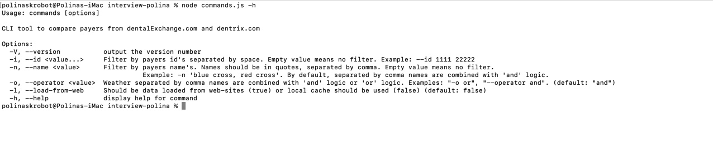

# InsideDesk Programming Project solution

## Project
To start using this tool, please, use '-l' command: `node commands.js  -l`. It will load data from websites and save them locally for the futher faster search. Data will be saved in JSON files. Any time you want to update the files, just use this command again.
### Available commands in CLI:

 

### Filter by a name:
 Too big, right? :)

### Filtering by names:
(default operand for search 'AND')

### Filtering by several names, with 'OR' logic:

### Filtering by id:

### Filtering by id and names:
(There is 'or' logic between id's, if we use several. There is 'and' logic between id and names. Logig for names is regulated by '-o' argument)

## Dependencies:
"commander": "^8.3.0",
"puppeteer": "^11.0.0"